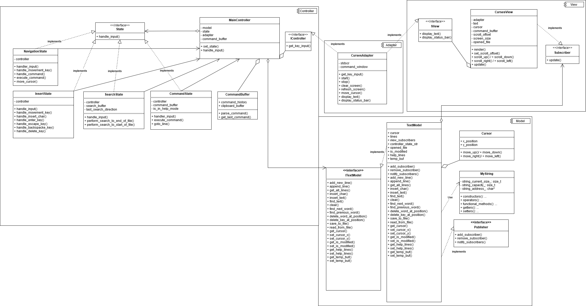
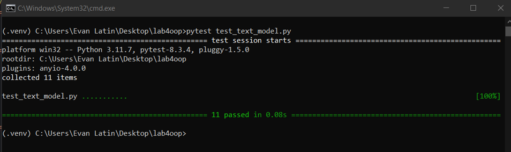
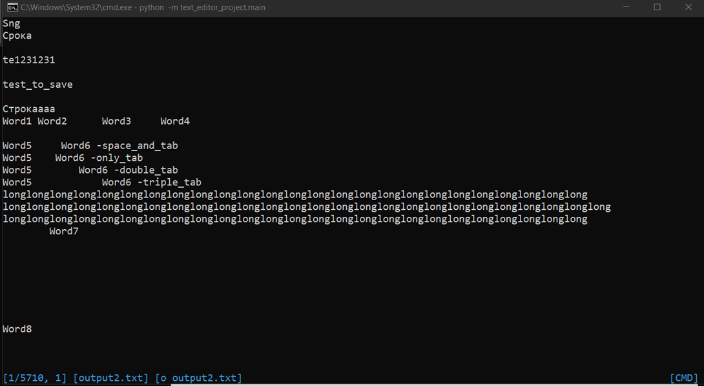
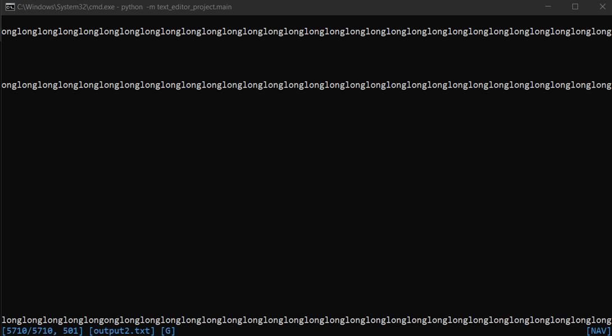
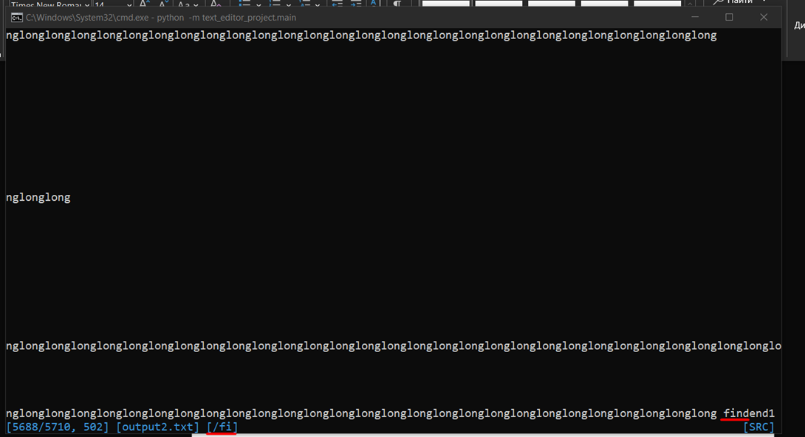
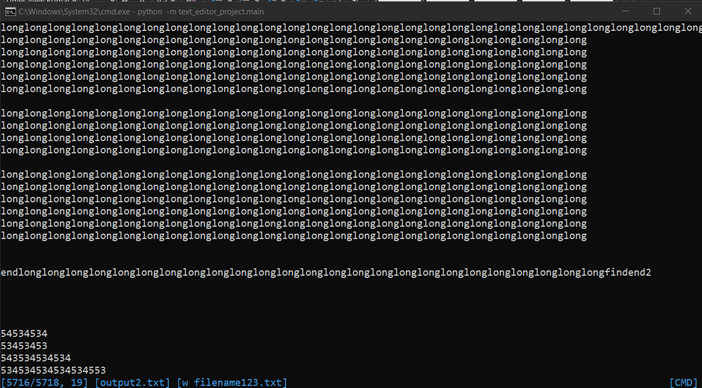
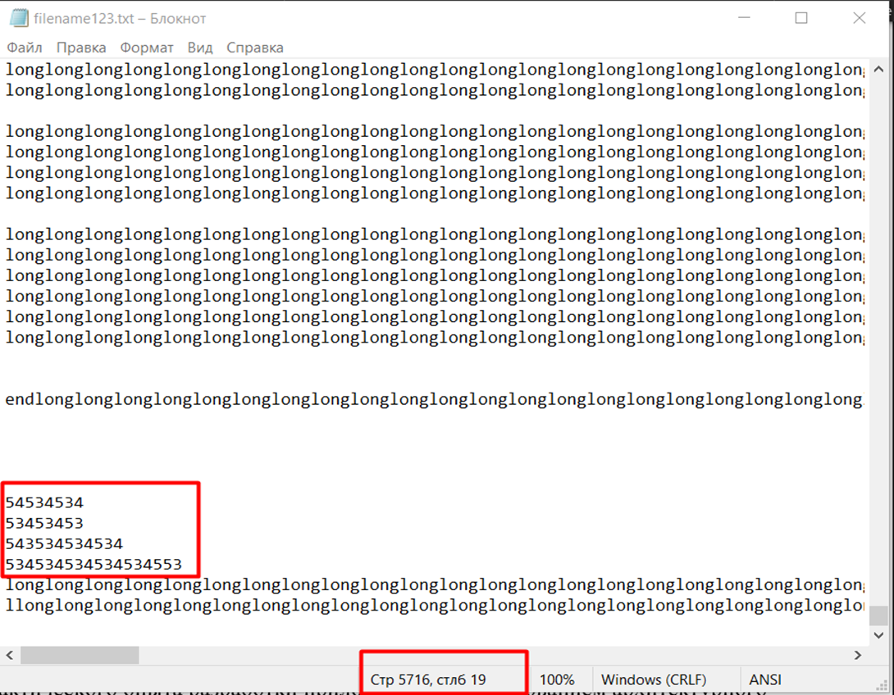

# VIM-like Text Editor

## Purpose
The purpose of this project is to familiarize developers with fundamental software design patterns and to gain experience in developing applications based on the **Model-View-Controller (MVC)** architectural pattern.

## Note
As a core of Model business logic was used self-implemented MyString C++ class that was wrapped to Python 3.11 lib

[See MyString](https://github.com/IBearSu/MyString)

## Objectives
As part of this laboratory work, it is required to develop a **VIM-like text editor** using **Python 3** that meets the following requirements:

1. The program must be developed using the **MVC architectural pattern**.
2. During the design phase, a **UML class diagram** must be created.
3. The program must feature a **TUI (Text User Interface)**:
   - The `curses` module should be used for TUI development.
   - The **Adapter design pattern** should be applied to integrate the module into the program's core logic.
   - The interface should support **cursor display** and a **status bar** (similar to the original VIM interface).
   - The **status bar** should display:
     - The **current editor mode** (editing, command input, help window, search, etc.).
     - The **file name**.
     - The **current line number** and the **total number of lines**.
4. The program must support **single-byte text encoding**.
5. The program must use a **Python wrapper over a custom `MyString` class**, developed in the first laboratory work. If modifications or extensions are required, the **Decorator design pattern** should be applied.
6. The program must support the following modes:

### A. Navigation and Editing Mode
   - This is the **default mode** when the program starts.
   - Transitions to **Input Mode** and **Search Mode** are performed from here.

### B. Command Input Mode
   - A list of supported commands is provided in **Appendix 1**.
   - Activation: `:`
   - Exit back to Navigation Mode: `ESC`

### C. Input Mode (Text Editing)
   - Entering text at the cursor position.
   - Activation:
     - Before the cursor: commands from the **Text Input** section in **Appendix 1**.
     - After the cursor: `o`
     - Clear the current line and start typing from the beginning: `S`
     - Exit back to Navigation Mode: `ESC`

### D. Search Mode
   - Searching from the cursor position to the **end** or **beginning** of the document.
   - Activation:
     - Search forward (to the end of the document): `/`
     - Search backward (to the beginning of the document): `?`
     - Exit back to Navigation Mode: `ESC`

7. The project must include **unit tests** for the core functionality, implemented using the **pytest** framework.

## UML diagram of the application

## Implementation Details
The application is built using a **modular MVC (Model-View-Controller) architecture**, ensuring a clear separation of responsibilities:

1. **Controller:** Manages the application state and mode switching (navigation, commands, search, text input). It handles user input and forwards commands to the appropriate modules.
2. **Model:** Stores text data, cursor position, and file state (open, save, modifications). It handles text operations (search, insert, delete) and notifies subscribers about changes.
3. **View:** Displays text and the status bar using the `curses` library. It updates the interface based on model data, supports scrolling, and displays different modes.

### Design Patterns Used
4. **State Pattern:** Implemented through classes representing different operational modes (navigation, text input, commands, search). Instead of using a single large method with multiple conditional statements (`if/elif/else`), each mode is encapsulated as a separate class, improving readability, scalability, and testability.
5. **Publisher-Subscriber (Pub-Sub) Pattern:** Implemented in the View class, allowing screen updates to occur only when the **Model** changes, rather than running cyclic updates that reduce performance.
6. **Adapter Pattern:** Provides an abstraction for working with `curses`, simplifying input-output operations and interface management. Interface implementations are provided at lower levels—**View (`IVAdapter`)** and **Controller (`ICAdapter`)**.

## Unit Tests
The following unit tests are implemented to verify the core functionality of the program:

- **`test_add_new_line`**: Ensures the new line addition method correctly adds a line to the model.
- **`test_append_line`**: Verifies that the method correctly appends a line to the end.
- **`test_insert_text`**: Tests proper text insertion at a given index.
- **`test_delete_all_text_on_the_line`**: Checks the deletion of all text in a line.
- **`test_find_text`**: Verifies text search functionality in lines.
- **`test_find_text_not_found`**: Ensures the search method returns `None` if text is not found.
- **`test_insert_char`**: Tests inserting a single character at a specified position.
- **`test_clear_text`**: Ensures all lines in the model are cleared.
- **`test_delete_word_at_position`**: Verifies word deletion at a specified position in a line.
- **`test_add_subscriber`**: Ensures a subscriber is correctly added to the list.
- **`test_remove_subscriber`**: Ensures a subscriber is correctly removed from the list.

## Tests result

## Manual testing
# Manual testing of a 757KB file loading

# Manual testing of screen scrolling when text is longer than screen size

# Manual testing of find command

# Manual testing of writing to file

## Conclusion
The primary goal of this work was achieved — gaining familiarity with fundamental software design patterns and acquiring practical experience in developing applications using the Model-View-Controller (MVC) architectural pattern.

During the development process with MVC, key aspects of design patterns were implemented, including separation of concerns, data encapsulation, and application state management. As a result, the application became more flexible and scalable, enhancing UI support and integration capabilities with various data sources.

